# Technical Design Document (TDD)

> Complementa `docs/00-proposta-resumo.md` (o quê e por quê) com o como. Toda decisão
> aqui deve respeitar `specs/constitution.md`; mudanças de arquitetura relevantes
> geram um ADR em `docs/adr/`.

## 1. Visão geral da arquitetura

```mermaid
flowchart LR
    subgraph Fontes["Fontes públicas (seção 5 da proposta)"]
        SGS[SGS/BCB]
        PEIC[PEIC/CNC]
        EPAE[EPAE/BCB]
        SPA[Painéis SPA/MF]
        GT[Google Trends]
        PT[Portal Transparência/CadÚnico]
        ESTBAN[ESTBAN/BCB]
        IBGE[IBGE]
    end

    subgraph Ingestao["src/data/ — spec 01"]
        COLETA[coletar por fonte]
    end

    subgraph Tratamento["src/features/ — spec 02"]
        TRAT[tratamento: deflacionar, imputar, outliers]
        DIAG[diagnóstico: sazonalidade, estacionariedade, corr. cruzada]
        QUEB[quebras estruturais]
        TERR[indicador composto territorial]
    end

    subgraph Modelagem["src/models/ — spec 03"]
        BASE[baseline naive]
        ECON[econométricos c/ exógenas]
        ML[ML série única]
        VAL[validação rolling origin]
        CEN[cenários 24m + custo patrimonial]
    end

    subgraph Avaliacao["src/evaluation/ — spec 04"]
        MET[métricas de erro relativo]
        TEST[teste estatístico Diebold-Mariano]
        HARN[harness de regressão entre execuções]
    end

    subgraph Entrega["src/reporting/, src/dashboard/ — spec 05"]
        FIG[figuras/tabelas]
        DASH[painel Streamlit]
        MONO[monografia]
    end

    Fontes --> COLETA
    COLETA -->|"data/interim/"| TRAT
    TRAT -->|"data/processed/base_nacional_*"| DIAG
    TRAT --> QUEB
    TRAT --> TERR
    DIAG --> BASE & ECON & ML
    BASE & ECON & ML --> VAL --> MET --> TEST --> HARN
    HARN -->|"aprovado"| CEN
    QUEB -->|"confronto c/ calendário regulatório"| FIG
    TERR -->|"Recortes 1 e 2, sem projeção/modelagem"| FIG
    CEN --> FIG
    HARN --> FIG
    FIG --> DASH
    FIG --> MONO
```

## 2. Stack tecnológica

| Camada | Escolha | Justificativa |
|---|---|---|
| Linguagem | Python 3.11+ | Exigida implicitamente pela proposta ("rotinas parametrizadas de extração em Python"); ecossistema maduro de séries temporais. |
| Manipulação de dados | pandas, pyarrow (parquet) | Padrão para dados tabulares; parquet para armazenamento eficiente e tipado em `data/processed/`. |
| Séries temporais / estatística | statsmodels | Testes de estacionariedade (ADF/KPSS), decomposição sazonal, SARIMAX. |
| Detecção de quebras estruturais | `ruptures` | Biblioteca dedicada a detecção de change points sem supervisão — decisão a confirmar em ADR quando a Etapa 4 começar. |
| ML para séries | scikit-learn / lightgbm | Modelos de gradient boosting sobre features de defasagem, conforme escada de modelos da Etapa 5. |
| Teste estatístico de comparação | implementação própria ou `statsmodels`/pacote dedicado a Diebold-Mariano | A decidir em ADR ao iniciar `specs/04-avaliacao`. |
| Visualização | matplotlib/plotly | Figuras estáticas para a monografia (matplotlib) e interativas para o dashboard (plotly, via Streamlit). |
| Dashboard | Streamlit | Decisão do grupo (constitution §7) — Python puro, integra direto com o pipeline pandas existente. |
| Testes | pytest | Padrão do ecossistema Python; suporta marks (`@pytest.mark.network`) para separar testes de integração com rede. |
| MCP | SDK oficial `mcp` (Python, FastMCP) | Usado em `.mcp/server.py` para expor as skills do projeto como tools/resources. |

Nenhuma biblioteca proibida foi definida na proposta; a lista acima é o padrão
assumido e pode ser expandida via ADR conforme necessidade.

## 3. Fluxo de dados ponta a ponta

1. **Ingestão** (`src/data/`, spec 01): cada fonte pública vira um DataFrame
   long-format bruto, com proveniência registrada, truncado na data de corte
   (31/12/2025).
2. **Tratamento e EDA** (`src/features/`, spec 02): deflacionamento IPCA, imputação
   documentada, detecção de outliers (sinalizados, não removidos silenciosamente),
   decomposição sazonal, testes de estacionariedade, correlação cruzada com
   defasagens, detecção de quebras estruturais (sem informar datas regulatórias ao
   algoritmo) e construção do indicador composto territorial (Recortes 1 e 2).
3. **Modelagem** (`src/models/`, spec 03): escada de modelos (naive → econométrico
   com exógenas → ML) treinada e validada por rolling origin, exclusivamente sobre o
   núcleo nacional. Cenários de 24 meses e simulação de custo patrimonial rodam sobre
   o modelo campeão.
4. **Avaliação** (`src/evaluation/`, spec 04): métrica de erro relativo + teste
   estatístico de diferença de desempenho decidem o modelo campeão; harness de
   regressão impede que uma nova execução piore silenciosamente o resultado.
5. **Entrega** (`src/reporting/`, `src/dashboard/`, spec 05): figuras/tabelas para a
   monografia e painel Streamlit consomem exclusivamente `data/processed/` — nenhuma
   lógica de cálculo nova nesta camada.

## 4. Decisões de modelagem e trade-offs considerados

- **Rolling origin vs. split aleatório:** split aleatório foi descartado
  categoricamente (constitution §2) — é a causa mais comum de resultados
  inflacionados em séries temporais e violaria a exigência textual da proposta.
- **MASE/sMAPE vs. RMSE puro como métrica principal:** erro relativo é preferido
  como métrica de decisão porque as séries do projeto têm escalas muito diferentes
  (ex.: valores em R$ bilhões vs. percentuais de inadimplência); RMSE/MAE ficam como
  leitura complementar. Escolha final entre MASE e sMAPE registrada em ADR ao
  iniciar `specs/04-avaliacao`.
- **Indicador territorial como aproximação, não modelo:** dado que não há
  estatística oficial desagregada por UF/município (delimitação explícita da
  proposta), optou-se por não tratar o indicador composto como output de um modelo
  estatístico validável — é uma construção documentada e transparente, avaliada por
  plausibilidade, não por acurácia.
- **Scraping como último recurso:** o grupo decidiu evitar scraping ao máximo
  (constitution §4). Onde uma fonte não tiver API oficial estável, o plano é
  primeiro buscar exportação manual oficial (CSV/XLSX do próprio portal) antes de
  recorrer a scraping ou bibliotecas não-oficiais; se nenhuma alternativa existir, a
  limitação é declarada e o escopo do indicador afetado pode ser reduzido, em vez de
  depender de scraping frágil sem aviso.

## 5. Estratégia de testes e validação

Ver `docs/adr/` para decisões pontuais e `tests/` para a implementação. Camadas:

- **Qualidade de dados** (`tests/data_quality/`): schema, completude, duplicatas,
  ranges, data de corte — roda a cada execução do pipeline de ingestão/tratamento.
- **Unitários** (`tests/unit/`): funções de transformação e feature engineering,
  sem rede, com fixtures gravadas.
- **Integração** (`tests/integration/`): coleta real contra as fontes (marcada
  `@pytest.mark.network`, não roda em `make test` padrão, roda em `make test-network`
  ou equivalente) e teste de fumaça do dashboard.
- **Harness de comparação de modelos** (`tests/model_eval_harness/`): regressão de
  performance entre execuções — falha se a métrica do modelo campeão piorar além do
  limiar definido.
- **Reprodutibilidade:** seeds fixas em toda operação estocástica; ambiente
  controlado via `requirements.txt` com versões fixadas.

## 6. Riscos conhecidos e plano de mitigação

| Risco | Mitigação |
|---|---|
| Fonte sem API oficial estável (Google Trends, painéis SPA/MF, Portal da Transparência) | Preferência estrita por exportação manual oficial; scraping só como último recurso, documentado; degradar escopo do indicador territorial antes de depender de scraping frágil (constitution §4). |
| Séries de apostas com histórico curto | Combinar séries longas de endividamento como variável-resposta com dados setoriais como exógenas restritas ao período recente (já previsto na proposta, seção 8). |
| Ambiente regulatório instável (STF, novas portarias) | Cenário inercial sempre rotulado como condicional; monitorar mudanças normativas e registrar impacto em ADR se ocorrerem durante o projeto. |
| Divulgação intermitente/defasada de dados oficiais | Data de corte fixa (31/12/2025) e documentação explícita de qualquer defasagem restante no momento da publicação. |
| Indicador territorial mal interpretado como medição oficial | Rótulo `exploratorio: True` propagado em todo artefato territorial, da base até a monografia (constitution §5, spec 05 critério 3). |
| Regressão silenciosa de performance de modelo entre execuções | Harness de regressão obrigatório em `tests/model_eval_harness/` (spec 04). |
| Prazo institucional ainda não definido | `TASKS.md` não assume datas; atualizar assim que a UNIVESP/orientador definir cronograma. |

## 7. Mapeamento requisitos da proposta → componentes da arquitetura

| Requisito da proposta | Componente |
|---|---|
| Objetivo específico: integrar fontes públicas heterogêneas | `src/data/` (spec 01) |
| Objetivo específico: construir e validar indicador de exposição | `src/features/indicador_territorial.py` + validação de plausibilidade em `src/evaluation/validacao_territorial.py` |
| Objetivo específico: detectar quebras estruturais e confrontar com calendário regulatório | `src/features/quebras_estruturais.py` (spec 02) |
| Objetivo específico: comparar modelos sob validação temporal rigorosa | `src/models/` + `src/evaluation/` (specs 03 e 04) |
| Objetivo específico: projetar cenários e custo de oportunidade patrimonial | `src/models/cenarios.py`, `src/models/custo_patrimonial.py` (spec 03) |
| Objetivo específico: identificar UF de maior exposição e ilustrar distribuição municipal | `src/features/indicador_territorial.py` (spec 02, Recortes 1 e 2) |
| Objetivo específico: publicar base, código e documentação (FAIR) | `docs/dicionario_dados.md`, `docs/nota_metodologica.md`, publicação externa (spec 05) |
| Entregável: monografia | `reports/final/` (spec 05) |
| Entregável: base de dados integrada | `data/processed/` + publicação externa (spec 05) |
| Entregável: pipeline reprodutível parametrizado por período | Todo `src/` (specs 01–04), parametrização por `data_corte` |
| Entregável: painel interativo | `src/dashboard/` (spec 05) |
